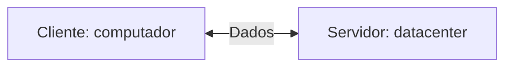
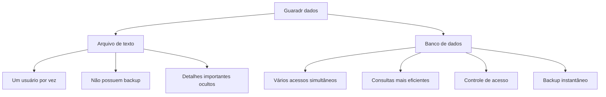
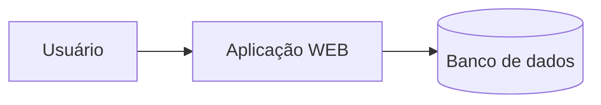
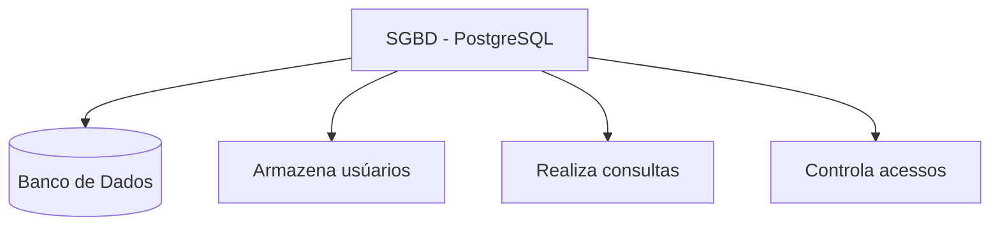

### Servidor de desenvolvimento 
Será uma interface de desenvolvimento , utilizada para projetar aplicações e banco de dados


---
### Servidor de arquivos educacional 
É um servidor para armazenar arquivos e facilitar na hora de realizar a transferência.

> O endereço para acesso ao servidor de arquivos é: `\\10.87.36.10`. 

>`Credenciais de acesso: E-mail: aluno, Senha: aluno`  

---
### Servidor Pessoal
O Moba será a interface para acesso ao meu servidor de desenvolvimento.

>O acesso, será realizado via SSH.
>Credenciais de acesso: `IP: 192.168.10.86`,Username: `root` e Porta:`2222`

Para o primeiro acesso , utilizamos a senha `aluno01`
Para alterar a senha ultilizamos o comando :
```bash 
passwd
```
Para vizualização dos recursos do meu servidor , utilizamos o comando: 

```bash
htop
``` 
|Recurso|Configuração|
|----|-------|
|Processador|2 cores|
|RAM|512MB|
|Armazenamento|6 GB|
|Sistema Operacional|Ubuntu 26.04 LTS|
---
A utilização de um servidor de desenvolvimenro simula um ambiente real de produção.

Os objetivos esperados são:

- Deploy de projetos;
- Aplicação de banco de dados;
- Experiência real de mercado.

### Banco de dados
Antigamente, os dados eram salvos em arquivos/planilhas.


---
>Mas afinal , onde entra o banco de dados em aplicações WEB 🤔?


### SGBD
Sistema Gerenciador de Banco de Dados. 
>Função: Gerenciar, Controlare Permitir consultas nos nossos Bancos de Dados


