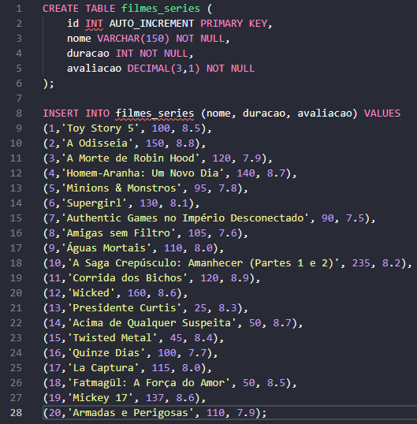

## Update e Delete 
**UPDATE** ou **DELETE** afetam todas as linhas da sua tabela. Logo, **JAMAIS** executar sem o comando `WHERE`.

```mermaid
flowchart LR 
A[SELECT com o WHERE]-->B {Retornou a linha certa?}
B--SIM-->C [Update ou DELETE]
B--NÃO-->A 
```
##### Criação de um banco de dados 
Comecei com o código no "moba" :
`sudo -u postgres psql` 
`CREATE DATABASE filmes` (não tive um nome muito criativo para a tabela ainda  pode ser que no final eu mude)
`\l` - para visualizar os arquivos e \q para fechar o programa. 


Em seguida, atribui as informações necessárias para a criação do banco de dados:

 


Para exibir os 10 filmes melhores avaliados:


Atualizei algumas notas: 


 
 E fica assim:


No final, a atividade pede para deletar 5 filmes lançados, ultilizei os códigos:


